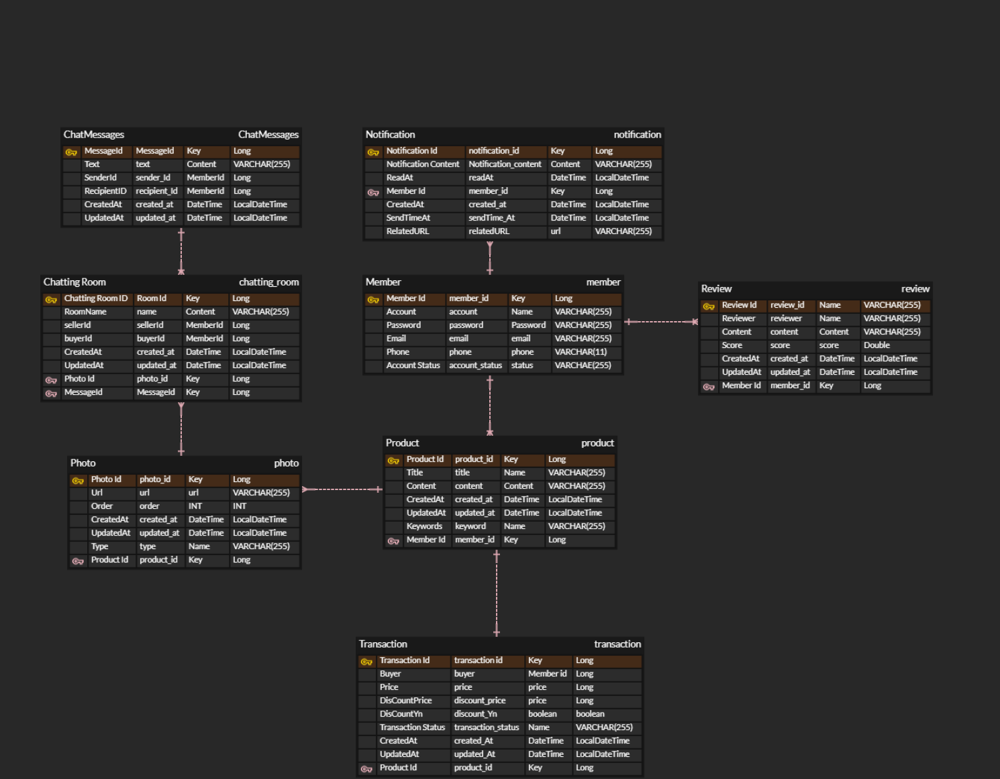

# 🗒 중고 거래 서비스

사용자들끼리 게시글을 작성해 서로 메시지를 통해 중고 거래를 할 수 있는 서비스입니다. 

## 프로젝트 기능 및 설계
- 회원가입 기능
  - 사용자는 회원가입을 할 수 있다. 일반적으로 모든 사용자는 회원가입시 USER 권한 (일반 권한)을 지닌다. 
  - 회원가입시 아이디와 패스워드를 입력받으며, 아이디는 unique 해야한다. 

- 로그인 기능
  - 사용자는 로그인을 할 수 있다. 로그인시 회원가입때 사용한 아이디와 패스워드가 일치해야한다. 

- 중고 상품 등록 기능 
  - 로그인한 사용자는 권한에 관계 없이 글을 작성할 수 있다. 
  - 사용자는 게시글 제목(텍스트), 게시글 내용(텍스트), 사진, 흥정 여부, 상품 분류를 작성할 수 있다.
  

- 중고 상품 목록 조회 기능 
  - 로그인하지 않은 사용자를 포함한 모든 사용자는 게시글을 조회할 수 있다. 
  - 게시글은 최신순으로 기본 정렬되며, 가격순 상품 분류에 따라 정렬이 가능하다.
  - 게시글 목록 조회시 응답에는 게시글 제목과 거래 상태, 가격, 작성일, 흥정 여부, 회원 ID가 필요하다.
  - 게시글은 종류가 많을수 있으므로 paging 처리를 한다. 

- 특정 게시글 조회 기능
  - 로그인하지 않은 사용자를 포함한 모든 사용자는 게시글을 조회할 수 있다. 
  - 게시글 제목, 게시글 사진, 게시글 내용, 작성자, 작성일, 가격, 작성자 평점이 조회된다. 
  
- 거래 당사자간 메시지 기능
  - 채팅 및 사진 업로드/조회 가능
  - [일반] 단계에서는 다수의 사용자와 1:1 메시지 가능
  - [거래중] 단계에서는 예약된 당사자와 1:1 메시지 가능( 거래 당사자 외 채팅 불가능)
  - [거래 완료] 단계에서는 거래 당사자간 채팅 가능, 회원에 대한 리뷰 및 평점 등록 가능

- 키워드 등록 기능
  - 사용자는 키워드를 등록해 다른 사용자가 게시글 키워드를 입력했을 경우 알람을 받을 수 있다.
- 리뷰 기능
  - 거래 완료 후 거래 당사자간 리뷰를 작성/수정/삭제할 수 있다.
  - 회원가입된 사용자는 회원 정보 조회를 통해 리뷰를 조회할 수 있다.

### ERD

### Trouble Shooting
[Go to Trouble Shooting MD](doc/TROUBLE_SHOOTING.md)

### Tech Stack

  